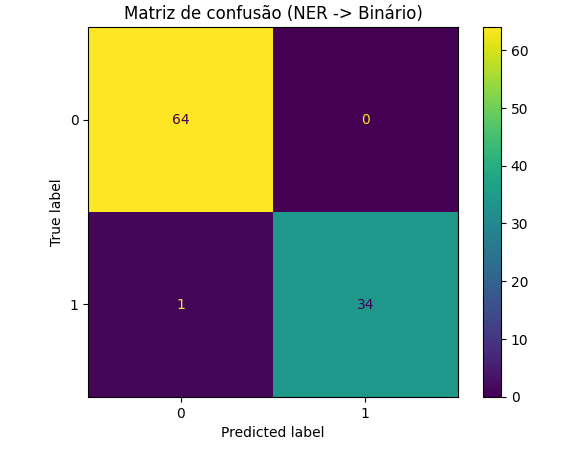

# solucao_desafiodf — Detecção de PII com NER (BERTpt) + regex

Este projeto implementa uma solução de **detecção de PII** em manifestações de ouvidoria usando:

1) **NER (Named Entity Recognition / Token Classification)** com *fine-tuning* do modelo **`neuralmind/bert-base-portuguese-cased`**  
2) Uma camada de **pós-processamento** (validação + regras) para converter as entidades previstas em uma decisão **binária** (0/1), conforme a regra do edital.

A regra de decisão final é:

- Se o pipeline detectar **pelo menos uma entidade válida** (CPF, Email, Número de telefone, Nome...)→ `y_pred = 1`
- Se não detectar entidade válida → `y_pred = 0`

A avaliação compara `y_pred` com `y_true` no CSV e calcula **Accuracy, Precision, Recall e F1**.

---

## Estrutura do Projeto
A solução está organizada da seguinte forma:

```text

├── data/
│   ├── dados_treino_ner_250.json        # Dataset sintético (Treino)
│   └── amostra_com_labels_1.csv         # Dataset real (Validação)
├── assets/
│    └──confusion_matrix.png             # Imagem da matriz de confusão
├── solucao_desafiodf.ipynb              # Notebook principal com todo o código
├── requirements.txt                     # Lista de dependências e versões
├── submission.csv                       # Arquivo de saída gerado pelo modelo
└── README.md                            # Documentação do projeto
```
---
## Datasets utilizados

_amostra_com_labels_1 - Página1.csv_: Conjunto amostral fornecido originalmente pelo GDF, porém, adicionei manualmente as labels (1 para textos que contenham dados pessoais e 0 para textos que não possuem) para que meu modelo de Reconhecimento de Entidades Nomeadas pudesse aprender quando estivesse acertando ou não. 

dados_treino_ner_250.json: Conjunto gerado sintéticamente com uso de IA Generativa, simulando solicitações reais,  para melhor a performace do modelo com Data Augmentation.

Coloque os dados na pasta `data/`:

- **Treino (NER sintético)**: `dados_treino_ner_250.json`  
  Estrutura por exemplo:
  ```json
  { "tokens": ["Meu","nome","é","Ana","Silva"], "ner_tags": ["O","O","O","B-PER","I-PER"] }
  ```
  - `tokens`: tokens já segmentados
  - `ner_tags`: labels **BIO** no mesmo tamanho de `tokens`

- **Validação (real, binário)**: `amostra_com_labels_1 - Página1.csv`  
  - Colunas: `Texto Mascarado`, `y_true`

---

## Resultado final (validação no CSV)

Métricas obtidas em `amostra_com_labels_1 - Página1.csv`:

- **Accuracy**: `0.9899`
- **Precision**: `1.0000`
- **Recall (Sensibilidade)**: `0.9714`
- **F1**: `0.9855`

### Nota P1 (conforme edital)

A nota P1 é definida como:

\[
P1 = \frac{2 \cdot (Precis\~ao \times Sensibilidade)}{Precis\~ao + Sensibilidade}
\]

Substituindo:

- Precisão = `1.0000`
- Sensibilidade = `0.9714`

\[
P1 = \frac{2 \cdot (1.0000 \times 0.9714)}{1.0000 + 0.9714} = 0.9855072463768115
\]

✅ **P1 obtida:** `0.9855072463768115`

---

## Matriz de confusão (NER → Binário)
Aqui mostra a quantidade de falsos ngativos, falsos positivos, verdadeiros negativos e verdadeiros positivos.
Sendo:
TN=64  FP=0  FN=1  TP=34
- TN (Verdadeiros negativos): 64
- FP (Falsos positivos): 0
- FN (Falsos ngativos): 1
- TP (Verdadeiros positivos): 34



---

# Estratégia (explicada do jeito que foi implementada)

## 1) Por que NER (Token Classification)?
Regex resolve bem “PII forte” (email, CPF, telefone), mas em texto real existe muita variação:
- assinaturas (“Atenciosamente, Fulano de Tal”)
- autoidentificação (“Me chamo X”, “Eu, X…”)
- nomes com partículas (“de/da/do/dos/das”)
- números em formato de processo (SEI) que confundem qualquer regex “solta”

O NER (com BERT em português) aprende **padrões contextuais** e generaliza melhor.

---

## 2) Labels BIO e classes consideradas

O treino usa o esquema **BIO**:

- `O`: fora de entidade  
- `B-XXX`: início de entidade XXX  
- `I-XXX`: continuação de entidade XXX  

### Classes de PII tratadas no pipeline

**PII forte (alta confiabilidade)**  
Classes fáceis de validar (baixo risco de FP):
- **CPF**: `B-CPF` (e `I-CPF` se houver)
- **EMAIL**: `B-EMAIL`
- **PHONE / TELEFONE**: `B-PHONE` / `B-TELEFONE` (normalizados para o mesmo conceito no pós-processamento)

> Obs.: CNPJ foi testado no começo, mas removido da decisão final para evitar ruído desnecessário.

**PII fraca (depende de contexto/score)**  
- **PER (Pessoa)**: `B-PER`, `I-PER`
- **ADDR (Endereço)**: `B-ADDR`, `I-ADDR`

PER/ADDR são úteis, mas também geram falsos positivos se você aceitar qualquer saída do modelo. Por isso, entram com **validação + threshold**.

---

## 3) Fine-tuning do BERT (como o NER foi treinado)

### a) Preparação dos dados
- Carrega `dados_treino_ner_250.json`
- Cria um split pequeno `train/validation` apenas para monitorar o treino

### b) Tokenização com alinhamento de labels (subwords)
BERT quebra palavras em subwords. O treinamento faz alinhamento correto:
- `tokenizer(..., is_split_into_words=True)`
- usa `word_ids()` para mapear tokens originais → subwords
- o **primeiro subword** recebe a tag BIO do token original
- os subwords seguintes recebem `-100` para não entrar na loss

### c) Treinamento com Trainer
- Modelo: `AutoModelForTokenClassification.from_pretrained("neuralmind/bert-base-portuguese-cased", num_labels=...)`
- Treino: `Trainer` + `TrainingArguments`
- Métricas de monitoramento: `seqeval`

---

## 4) Inferência em texto real: chunking + stride (sem truncar)
O BERT trabalha com ~**512 tokens**. Para textos longos no CSV:
- o texto é dividido em **janelas** (`MAX_LENGTH=512`)
- com **sobreposição** (`STRIDE`, ex.: 256) para não perder entidade na borda
- *early-exit*: se qualquer janela detectar entidade válida, retorna `1`

---

## 5) Conversão NER → Binário (onde o desempenho final foi obtido)

A decisão binária não pode aceitar “qualquer entidade” porque:
- 1 entidade ruim vira FP
- números de processo/SEI podem virar “telefone” por engano
- palavras genéricas podem virar “pessoa” (PER) no modelo

Então a decisão foi feita em camadas:

### Camada A — Regras fortes no texto inteiro (recupera FN)
Antes do NER (ou em paralelo), o pipeline busca sinais fáceis e confiáveis:
- EMAIL
- PHONE (validado por quantidade de dígitos e contexto)
- CPF (quando aplicável)
- padrões de assinatura/autoidentificação (“Atenciosamente, Nome Sobrenome”, “Me chamo Nome”, “Eu, Nome…”)

### Camada B — NER + validação (corta FP)
Se não achou sinal forte, entra o NER com filtros:

**PER**
- bloqueia stopwords e palavras genéricas (“Obrigada”, “Atenciosamente”, etc.)
- exige “cara de nome” (capitalização e partículas do português)
- PER de 1 palavra só conta se estiver em contexto claro de assinatura/autoidentificação

**ADDR**
- descarta números soltos (ex.: “68” sozinho não vira endereço)

### Camada C — Ajuste de threshold focado em “menos erros”
O threshold das entidades fracas foi ajustado com foco em:
- **minimizar FP + FN** na validação real (CSV)

---

# Como rodar (tutorial)

## Pré-requisitos
**Linguagem:** Python 3.9 ou superior.
**Gerenciador de pacotes:** pip

Para garantir a reprodutibilidade, recomenda-se o uso de um ambiente virtual (venv) conforme descrito abaixo.

## 1) Instalar dependências

```bash
python -m venv .venv

# Windows:
.\.venv\Scripts\activate

# Linux/macOS:
# source .venv/bin/activate

pip install --upgrade pip
pip install -r requirements.txt
```


## 2) Dados em `data/`

Estrutura:


```
data/
  dados_treino_ner_250.json
  amostra_com_labels_1 - Página1.csv
```

## 3) Executar o notebook

O notebook do projeto é: **`solucao_desafiodf.ipynb`**

```bash
jupyter lab
# ou
jupyter notebook
```

Abra `solucao_desafiodf.ipynb` e execute as células em ordem:
- treino do NER (fine-tuning)
- inferência no CSV com chunking + pós-processamento
- relatório final + matriz de confusão
---

## Formato de Saída (Output)
A execução do notebook gera um arquivo chamado **`submission.csv`** na raiz do projeto. Este arquivo segue o formato CSV (separado por vírgulas) e contém as seguintes colunas:

* **texto**: O conteúdo original da manifestação analisada.
* **y_true**: A classificação real (gabarito), utilizada para validação durante o desenvolvimento.
* **y_pred**: A classificação predita pelo modelo (`1` para contendo dados pessoais, `0` para não contendo).

---

## requirements.txt (o que o projeto usa)

- `transformers`, `datasets`, `seqeval`, `accelerate` → fine-tuning NER
- `torch` → backend
- `scikit-learn` → métricas e matriz de confusão
- `pandas`, `numpy` → leitura/manipulação
- `matplotlib`, `tqdm` → plot e progresso

--- 
## Declaração de Uso de Inteligência Artificial

Em conformidade com o item 13.9 do Edital, detalha-se abaixo o uso de recursos de IA neste projeto:

### 1. IA Integrada à Solução (Core)
* **Modelo:** `neuralmind/bert-base-portuguese-cased` (Fine-tuning para NER).
* **Bibliotecas Principais:** `transformers`, `torch`, `seqeval`.
* **Fonte:** Hugging Face Hub.

### 2. Ferramentas de IA Generativa (Apoio)
Foram utilizadas ferramentas de LLM (Large Language Models) para suporte ao desenvolvimento:
* **Geração de Dados Sintéticos:** Utilização de **ChatGPT (GPT-4)**, **Gemini** e **Grok** para criar variações linguísticas de manifestações de ouvidoria (Data Augmentation), permitindo treinar o modelo com cenários mais complexos que não existiam na amostra original.
* **Documentação e Código:** Apoio na revisão de textos da documentação e otimização de snippets de código.